# Neighborhood Hub


A multi-platform full-stack app for Bulgarian neighborhoods — skill sharing, time swapping, and community connection.

 
## Daily contribution marker: 2026-05-07

---

## Daily contribution marker: 2026-05-08


## What It Does

Neighbors can:
- **Share skills** — offer and request help (repairs, cooking, tutoring, gardening, etc.)
- **Borrow tools** — reserve tools from neighbors with a date range
- **Join events** — RSVP to neighborhood events and community meetups
- **Support drives** — pledge to charity and donation initiatives
- **Share food** — list surplus food; neighbors request and pick up
- **Browse and filter listings** — by category, location, status, keyword search
- **Chat with an AI assistant** — get help navigating the platform
- **Admin panel** — manage users, lock accounts, audit all actions

---

## Demo Credentials

**Web app:** https://neighborhood-hub.netlify.app

**Mobile web:** https://hristiyanstoilov.github.io/Neighborhood-Hub/

| Role | Email | Password |
|------|-------|----------|
| Regular user | `demo@neighborhoodhub.bg` | `demo1234` |
| Seed users (ivan, maria, georgi…) | e.g. `ivan@demo.bg` | `Demo1234!` |

> To get admin access, register an account and ask the maintainer to promote it, or run `UPDATE users SET role = 'admin' WHERE email = '...'` against the DB.

---

## Tech Stack

| Layer | Technology |
|-------|-----------|
| Backend API | Next.js 15 (App Router) + TypeScript |
| Database | Neon PostgreSQL + Drizzle ORM |
| Auth | JWT (access + refresh tokens, custom middleware) |
| Web Frontend | React + TypeScript + Tailwind CSS 4 |
| Mobile | React Native + Expo 54 |
| AI | Anthropic claude-haiku-4-5 |
| Email | Resend |
| Rate Limiting | Upstash Redis + @upstash/ratelimit |
| Storage | Cloudflare R2 (photos/files) |
| Deployment | Netlify (serverless) |

---

## Project Structure

```
neighborhood-hub/
├── packages/
│   ├── nextjs/                  # Backend API + Web frontend
│   │   ├── src/
│   │   │   ├── app/
│   │   │   │   ├── api/         # REST API routes
│   │   │   │   │   ├── auth/    # register, login, logout, refresh, me, verify-email, resend-verification, forgot-password, reset-password
│   │   │   │   │   ├── skills/  # CRUD skill listings
│   │   │   │   │   ├── skill-requests/  # booking requests state machine
│   │   │   │   │   ├── notifications/   # in-app notifications
│   │   │   │   │   ├── profile/         # user profile
│   │   │   │   │   ├── tools/           # CRUD tool listings
│   │   │   │   │   ├── tool-reservations/ # reservation state machine
│   │   │   │   │   ├── events/          # CRUD events + attendees (RSVP)
│   │   │   │   │   ├── drives/          # CRUD community drives + pledges
│   │   │   │   │   ├── food-shares/     # CRUD food listings + reservations
│   │   │   │   │   ├── admin/           # admin user management + audit log
│   │   │   │   │   └── ai/              # AI chat + conversation history
│   │   │   │   └── (web)/       # Web pages (React server components)
│   │   │   ├── components/      # Shared React components
│   │   │   ├── contexts/        # Auth context
│   │   │   ├── db/
│   │   │   │   ├── schema.ts    # Drizzle schema (31 tables)
│   │   │   │   └── migrations/  # SQL migration files
│   │   │   └── lib/
│   │   │       ├── auth.ts      # JWT sign/verify helpers
│   │   │       ├── middleware.ts # requireAuth / requireAdmin wrappers
│   │   │       ├── ratelimit.ts # Upstash rate limiters
│   │   │       ├── email.ts     # Resend email templates
│   │   │       ├── audit.ts     # Audit log writer
│   │   │       ├── api.ts       # Client fetch helper (auto Content-Type, token refresh)
│   │   │       ├── format.ts    # Shared date/status formatting utilities
│   │   │       ├── queries/     # Reusable DB query functions
│   │   │       └── schemas/     # Zod validation schemas
│   │   └── package.json
│   └── mobile/                  # React Native mobile app (Expo 54)
│       ├── app/
│       │   ├── (app)/           # Authenticated screens
│       │   └── (auth)/          # Login / Register screens
│       ├── components/          # Shared RN components (Skeleton, SkeletonCard, etc.)
│       ├── contexts/            # Auth context (mobile)
│       └── lib/                 # API client, token storage, format utils, toast
├── AGENTS.md                    # AI agent instructions + coding rules
└── README.md
```

---

## Database Schema

31 tables across 8 concern areas.

### Entity Relationship Diagram

```mermaid
erDiagram
    users ||--|| profiles : "has"
    users ||--o{ refresh_tokens : "has"
    users ||--o{ user_consents : "gives"
    users ||--|| user_stats : "has"
    users ||--o{ badges : "earns"
    users ||--o{ audit_log : "logged_in"

    profiles }o--o| locations : "located_at"

    users ||--o{ skills : "owns"
    skills }o--|| categories : "in"
    skills }o--o| locations : "at"
    skills ||--o{ skill_endorsements : "receives"
    skills ||--o{ skill_requests : "booked_via"
    skill_requests ||--o{ notifications : "triggers"

    users ||--o{ tools : "owns"
    tools }o--|| categories : "in"
    tools }o--o| locations : "at"
    tools ||--o{ tool_reservations : "reserved_via"

    users ||--o{ events : "organizes"
    events }o--o| locations : "held_at"
    events ||--o{ event_attendees : "rsvp"

    users ||--o{ community_drives : "organizes"
    community_drives ||--o{ drive_pledges : "receives"

    users ||--o{ food_shares : "owns"
    food_shares }o--o| locations : "at"
    food_shares ||--o{ food_reservations : "reserved_via"

    users ||--o{ ratings : "gives"
    users ||--o{ feed_events : "generates"
    users ||--o{ reports : "files"
    users ||--o{ user_blocks : "blocks"
    users ||--o{ push_tokens : "registers"

    users ||--o{ conversations : "participates"
    conversations ||--o{ messages : "contains"

    users ||--o{ ai_conversations : "has"
    ai_conversations ||--o{ ai_messages : "contains"
```



### Tables by Area

#### Auth & Users
| Table | Purpose |
|-------|---------|
| `users` | Auth only (email, password_hash, role, lockout, soft delete) |
| `profiles` | Profile data (name, bio, avatar_url, location_id FK, is_public) |
| `refresh_tokens` | JWT refresh tokens with rotation + revocation |
| `user_consents` | GDPR consent tracking |
| `audit_log` | Admin action log with metadata jsonb |

#### Skills & Requests
| Table | Purpose |
|-------|---------|
| `categories` | Normalized skill categories (slug UNIQUE, label) |
| `locations` | Neighborhood-level geo centroids (GDPR compliant) |
| `skills` | Skill listings (owner_id, title, category, status, soft delete) |
| `skill_endorsements` | Peer endorsements on skill listings (unique per endorser+skill) |
| `skill_requests` | Booking requests — full state machine |
| `notifications` | In-app notifications triggered by request status changes |

#### Tool Library
| Table | Purpose |
|-------|---------|
| `tools` | Tool listings (owner_id, title, condition, category, location, status, soft delete) |
| `tool_reservations` | Borrow requests — pending → approved → returned/rejected/cancelled |

#### Events
| Table | Purpose |
|-------|---------|
| `events` | Neighborhood events with schedule, location, status, and capacity |
| `event_attendees` | RSVP records per user/event |

#### Community Drives
| Table | Purpose |
|-------|---------|
| `community_drives` | Donation and community initiatives |
| `drive_pledges` | User pledges for a drive |

#### Food Sharing
| Table | Purpose |
|-------|---------|
| `food_shares` | Food listings with quantity, status, and pickup details |
| `food_reservations` | Reservation workflow for shared food |

#### Community & Social
| Table | Purpose |
|-------|---------|
| `ratings` | Mutual ratings after completed skill requests and tool returns |
| `feed_events` | Activity feed (skill listed, tool listed, food shared, event created) |
| `conversations` | DM conversation pairs (participantA, participantB unique) |
| `messages` | DM messages within conversations |
| `push_tokens` | Expo push notification tokens per user device |

#### Gamification & Safety
| Table | Purpose |
|-------|---------|
| `user_stats` | Points, level, rank per user |
| `badges` | Earned badges (type, earnedAt) |
| `reports` | Content reports with moderation status |
| `user_blocks` | Block relationships between users |

#### AI Chat
| Table | Purpose |
|-------|---------|
| `ai_conversations` | Chat sessions (user_id, title, soft delete) |
| `ai_messages` | Individual messages (role: user/assistant, content) |

### State Machines

#### Skill Request
```
pending ──[owner accepts]──→ accepted ──[requester confirms]──→ completed
   │                             │
   │                             └──[anyone cancels]──→ cancelled
   ├──[owner rejects]──→ rejected
   └──[requester cancels]──→ cancelled
```

#### Tool Reservation
```
pending ──[owner approves]──→ approved ──[owner marks returned]──→ returned
   │                              │
   │                              └──[owner or borrower cancels]──→ cancelled
   ├──[owner rejects]──→ rejected
   └──[borrower cancels]──→ cancelled
```

#### Food Reservation
```
pending ──[owner approves]──→ reserved ──[owner marks picked up]──→ picked_up
   │
   ├──[owner rejects]──→ rejected
   └──[requester or owner cancels]──→ cancelled
```

#### Event RSVP
```
going ──[user toggles]──→ not_going
not_going ──[user toggles]──→ going
```

#### Drive Pledge
```
pledged ──[organizer marks fulfilled]──→ fulfilled
pledged ──[user or organizer cancels]──→ cancelled
```

---

## API Reference

### Auth
| Method | Route | Auth | Description |
|--------|-------|------|-------------|
| POST | `/api/auth/register` | — | Register new user |
| POST | `/api/auth/login` | — | Login → access token + refresh cookie |
| POST | `/api/auth/logout` | JWT | Revoke refresh token |
| POST | `/api/auth/refresh` | cookie | Rotate refresh token |
| GET | `/api/auth/me` | JWT | Get current user |
| POST | `/api/auth/verify-email` | — | Verify email with token |
| POST | `/api/auth/resend-verification` | JWT | Resend verification email |
| POST | `/api/auth/forgot-password` | — | Send password reset email |
| POST | `/api/auth/reset-password` | — | Set new password with token |

### Skills
| Method | Route | Auth | Description |
|--------|-------|------|-------------|
| GET | `/api/skills` | — | List skills (search, filter, paginate) |
| POST | `/api/skills` | JWT + verified | Create skill listing |
| GET | `/api/skills/[id]` | — | Get skill detail |
| PUT | `/api/skills/[id]` | JWT + owner | Edit skill |
| DELETE | `/api/skills/[id]` | JWT + owner | Soft delete skill |
| PATCH | `/api/skills/[id]/status` | JWT + owner | Change skill status |

### Skill Requests
| Method | Route | Auth | Description |
|--------|-------|------|-------------|
| GET | `/api/skill-requests` | JWT | List my requests (sent/received) |
| POST | `/api/skill-requests` | JWT + verified | Create request |
| PATCH | `/api/skill-requests/[id]` | JWT | Update status (state machine) |

### Tools
| Method | Route | Auth | Description |
|--------|-------|------|-------------|
| GET | `/api/tools` | — | List tools (search, filter by category/location/status, paginate) |
| POST | `/api/tools` | JWT + verified | Create tool listing |
| GET | `/api/tools/[id]` | — | Get tool detail |
| PUT | `/api/tools/[id]` | JWT + owner | Edit tool |
| DELETE | `/api/tools/[id]` | JWT + owner | Soft delete tool |

### Tool Reservations
| Method | Route | Auth | Description |
|--------|-------|------|-------------|
| GET | `/api/tool-reservations` | JWT | List my reservations (as borrower or owner) |
| POST | `/api/tool-reservations` | JWT + verified | Create reservation request |
| PATCH | `/api/tool-reservations/[id]` | JWT | Update status (approve/reject/return/cancel) |

### Food Shares
| Method | Route | Auth | Description |
|--------|-------|------|-------------|
| GET | `/api/food-shares` | — | List food shares (status/owner filters, pagination) |
| POST | `/api/food-shares` | JWT + verified | Create food listing |
| GET | `/api/food-shares/[id]` | — | Get food share detail |
| PATCH | `/api/food-shares/[id]` | JWT + owner | Update food listing |
| DELETE | `/api/food-shares/[id]` | JWT + owner | Soft delete food listing |

### Food Reservations
| Method | Route | Auth | Description |
|--------|-------|------|-------------|
| GET | `/api/food-shares/[id]/reservations` | JWT | List reservations for a food share |
| POST | `/api/food-shares/[id]/reservations` | JWT + verified | Create reservation request |
| PATCH | `/api/food-shares/[id]/reservations/[reservationId]` | JWT | Update reservation state |
| GET | `/api/food-reservations` | JWT | List my food reservations |

### Events
| Method | Route | Auth | Description |
|--------|-------|------|-------------|
| GET | `/api/events` | — | List events |
| POST | `/api/events` | JWT + verified | Create event |
| GET | `/api/events/[id]` | — | Get event detail |
| PATCH | `/api/events/[id]` | JWT + owner | Update event |
| DELETE | `/api/events/[id]` | JWT + owner | Soft delete event |
| POST | `/api/events/[id]/rsvp` | JWT | RSVP state toggle |

### Community Drives
| Method | Route | Auth | Description |
|--------|-------|------|-------------|
| GET | `/api/drives` | — | List drives |
| POST | `/api/drives` | JWT + verified | Create drive |
| GET | `/api/drives/[id]` | — | Get drive detail |
| PATCH | `/api/drives/[id]` | JWT + owner | Update drive |
| DELETE | `/api/drives/[id]` | JWT + owner | Soft delete drive |
| POST | `/api/drives/[id]/pledges` | JWT | Create pledge |
| PATCH | `/api/drives/[id]/pledges/[pledgeId]` | JWT | Update pledge status |

### Profile, Notifications & Uploads
| Method | Route | Auth | Description |
|--------|-------|------|-------------|
| GET | `/api/profile` | JWT | Get my profile |
| PUT | `/api/profile` | JWT | Update my profile (name, bio, avatar, location, visibility) |
| GET | `/api/notifications` | JWT | List my notifications |
| POST | `/api/notifications/read` | JWT | Mark notifications as read |
| POST | `/api/upload` | JWT | Upload image to Cloudflare R2 (JPEG/PNG/WebP, max 5 MB) |

### Admin
| Method | Route | Auth | Description |
|--------|-------|------|-------------|
| GET | `/api/admin/users` | JWT + admin | List all users |
| PATCH | `/api/admin/users/[id]` | JWT + admin | Lock/unlock/promote/delete user |
| GET | `/api/admin/audit` | JWT + admin | Audit log |

### AI Chat
| Method | Route | Auth | Description |
|--------|-------|------|-------------|
| POST | `/api/ai/chat` | JWT | Send message, get AI response |
| GET | `/api/ai/conversations` | JWT | List my conversations |
| GET | `/api/ai/conversations/[id]` | JWT | Load conversation messages |
| DELETE | `/api/ai/conversations/[id]` | JWT | Soft delete conversation |

---

## Web Screens

| Screen | Route |
|--------|-------|
| Home / Dashboard | `/` |
| Register | `/register` |
| Login | `/login` |
| Forgot Password | `/forgot-password` |
| Reset Password | `/reset-password` |
| Verify Email | `/verify-email` |
| Skill List + Search + Filters | `/skills` |
| Skill Detail + Request modal | `/skills/[id]` |
| Create Skill | `/skills/new` |
| Edit Skill | `/skills/[id]/edit` |
| My Requests | `/my-requests` |
| Profile View | `/profile` |
| Profile Edit | `/profile/edit` |
| Admin — Users | `/admin/users` |
| Admin — Audit Log | `/admin/audit` |
| Admin — Dashboard | `/admin/dashboard` |
| AI Chat | `/chat` |
| Tool Library | `/tools` |
| Tool Detail + Reserve | `/tools/[id]` |
| Create Tool | `/tools/new` |
| Edit Tool | `/tools/[id]/edit` |
| My Reservations | `/my-reservations` |
| Events List + Filters | `/events` |
| Event Detail + RSVP | `/events/[id]` |
| Create Event | `/events/new` |
| Edit Event | `/events/[id]/edit` |
| Community Drives List | `/drives` |
| Drive Detail + Pledge | `/drives/[id]` |
| Create Drive | `/drives/new` |
| Edit Drive | `/drives/[id]/edit` |
| Food Shares List + Filters | `/food` |
| Food Share Detail + Reserve | `/food/[id]` |
| Create Food Share | `/food/new` |
| Edit Food Share | `/food/[id]/edit` |
| My Events (RSVPs) | `/my-events` |
| My Pledges (Drives) | `/my-drives` |
| My Food Reservations | `/food/reservations` |
| Notifications | `/notifications` |
| Public Profiles | `/users/[id]` |

## Mobile Screens (Expo 54)

| Screen | Route |
|--------|-------|
| Login | `/(auth)/login` |
| Register | `/(auth)/register` |
| Skill List (paginated) | `/(app)/(tabs)/index` |
| Skill Detail + Request | `/(app)/skills/[id]` |
| Create Skill | `/(app)/skills/new` |
| Edit Skill | `/(app)/skills/edit/[id]` |
| Request Skill | `/(app)/skills/request/[id]` |
| My Requests (sent/received) | `/(app)/(tabs)/my-requests` |
| My Skills | `/(app)/my-skills` |
| Notifications | `/(app)/(tabs)/notifications` |
| Profile + Avatar Upload | `/(app)/(tabs)/profile` |
| Edit Profile | `/(app)/profile/edit` |
| Public User Profile | `/(app)/users/[id]` |
| AI Chat | `/(app)/chat` |
| Neighborhood Radar | `/(app)/radar` |
| Tool Library | `/(app)/tools` |
| Tool Detail + Reserve | `/(app)/tools/[id]` |
| Create Tool | `/(app)/tools/new` |
| Events List (paginated) | `/(app)/events` |
| Event Detail + RSVP | `/(app)/events/[id]` |
| Create Event | `/(app)/events/new` |
| Community Drives List (paginated) | `/(app)/drives` |
| Drive Detail + Pledge | `/(app)/drives/[id]` |
| Create Drive | `/(app)/drives/new` |
| Food Shares List (paginated) | `/(app)/food` |
| Food Share Detail + Reserve | `/(app)/food/[id]` |
| Create Food Share | `/(app)/food/new` |
| Edit Food Share | `/(app)/food/edit/[id]` |
| Edit Tool | `/(app)/tools/edit/[id]` |
| Edit Event | `/(app)/events/edit/[id]` |
| Edit Drive | `/(app)/drives/edit/[id]` |
| My Tool Reservations | `/(app)/tools/my-reservations` |
| My Food Reservations | `/(app)/food/reservations` |
| My Events (RSVPs) | `/(app)/events/my-rsvps` |
| My Pledges (Drives) | `/(app)/drives/my-pledges` |
| Forgot Password | `/(auth)/forgot-password` |

---

## Module Status

| Version | Module | Status |
|---------|--------|--------|
| 0.1 | Neighborhood Radar + Time & Skill Swap | ✅ Done |
| 0.2 | Tool Library | ✅ Done |
| 0.3 | Events + Community Drives | ✅ Done |
| 0.4 | Food Sharing | ✅ Done |
| 0.5 | Chat / Feed + Direct Messages | ✅ Done |

---

## Security

- **Passwords:** bcrypt cost=12. Never MD5/SHA1/SHA256.
- **JWT:** access token 15 min, refresh token 7 days (httpOnly cookie on web, SecureStore on mobile)
- **Refresh token rotation:** old token revoked on every refresh
- **Account lockout:** 5 failed attempts → locked 15 minutes
- **Timing attack protection:** dummy bcrypt hash compared on unknown email
- **Rate limiting** (Upstash Redis):
  - `POST /api/auth/login` → 5 req / 15 min / IP
  - `POST /api/auth/register` → 3 req / hour / IP
  - `POST /api/ai/chat` → 20 req / hour / user
  - All other routes → 100 req / min / user
- **Input validation:** all request bodies validated with Zod
- **Ownership checks:** all mutations filter by `owner_id` / `user_id`
- **Soft delete:** `deleted_at` on `users` and `skills`
- **Audit log:** all admin actions logged with metadata
- **Security headers:** `X-Frame-Options`, `X-Content-Type-Options`, `Referrer-Policy`, `Content-Security-Policy`, `Strict-Transport-Security`
- **Concurrent request protection:** partial unique index on `skill_requests(skill_id, user_from_id)` where status is `pending` or `accepted` — prevents race condition duplicates at the DB level

---

## Local Development

### Prerequisites
- Node.js 22+
- A [Neon](https://neon.tech) PostgreSQL database
- An [Upstash](https://upstash.com) Redis instance
- A [Resend](https://resend.com) API key (for emails)
- An [Anthropic](https://console.anthropic.com) API key (for AI chat)
- A [Cloudflare R2](https://www.cloudflare.com/developer-platform/r2/) bucket (for image uploads)

### Setup

```bash
# 1. Clone
git clone https://github.com/hristiyanstoilov/Neighborhood-Hub.git
cd Neighborhood-Hub

# 2. Install dependencies
npm install

# 3. Configure environment
cp packages/nextjs/.env.example packages/nextjs/.env.local
# Edit .env.local with your credentials

# 4. Run DB migrations
cd packages/nextjs && npm run db:migrate && cd ../..

# 5. (Optional) Seed categories, locations, and demo data
cd packages/nextjs && npm run db:seed && cd ../..

# 5a. (Optional) Bulk-seed 10,000+ records for scalability testing
cd packages/nextjs && npm run db:seed:bulk && cd ../..

# 6. Install mobile dependencies
cd packages/mobile && npm install --legacy-peer-deps && cd ../..

# 7. Start dev servers
npm run dev:web      # Next.js on http://localhost:3000
npm run dev:mobile   # Expo — scan QR with Expo Go app
```

### Environment Variables

```env
# Database (Neon)
DATABASE_URL=postgresql://...

# Auth
JWT_SECRET=...                  # min 32 chars, generate: openssl rand -base64 32

# Email (Resend)
RESEND_API_KEY=re_...
RESEND_FROM=noreply@yourdomain.com

# Rate Limiting (Upstash)
UPSTASH_REDIS_REST_URL=https://...
UPSTASH_REDIS_REST_TOKEN=...

# AI (Anthropic)
ANTHROPIC_API_KEY=sk-ant-...

# App URL
NEXT_PUBLIC_APP_URL=http://localhost:3000

# File Storage (Cloudflare R2) — required for avatar and skill image uploads
CLOUDFLARE_R2_BUCKET=...
CLOUDFLARE_R2_ACCOUNT_ID=...
CLOUDFLARE_R2_ACCESS_KEY=...
CLOUDFLARE_R2_SECRET_KEY=...
CLOUDFLARE_R2_PUBLIC_URL=https://pub-xxx.r2.dev
```

---

## Automated Tests

```bash
cd packages/nextjs

# Unit tests (181 tests — schemas, state machines, badges, auth, formatting)
npm test

# Integration tests (90 tests — DB queries against a real Neon test branch)
# Requires TEST_DATABASE_URL in .env.local pointing to a separate Neon branch
npm run test:integration

# E2E tests (20 tests — accessibility, visual snapshots, full API cycles)
# Requires a running dev server: npm run dev:web
npm run test:e2e
```

---

## Deployment (Netlify)

1. Go to [netlify.com](https://netlify.com) → Add new site → Import from GitHub
2. Set **Base directory** to `packages/nextjs`
3. Set **Build command** to `npm run build`
4. Set **Publish directory** to `packages/nextjs/.next`
5. Add all environment variables from `.env.example`
6. Deploy

The `netlify.toml` at the repo root is pre-configured for the monorepo layout.

---

## DB Migrations

```bash
cd packages/nextjs

# After changing schema.ts:
npx drizzle-kit generate        # generates SQL migration file
npm run db:migrate              # applies to DB (use this — drizzle-kit migrate hangs with Neon HTTP)

# Never use drizzle-kit push in production
```

---

## Contributing

See [AGENTS.md](AGENTS.md) for architecture decisions, coding rules, and business logic.
